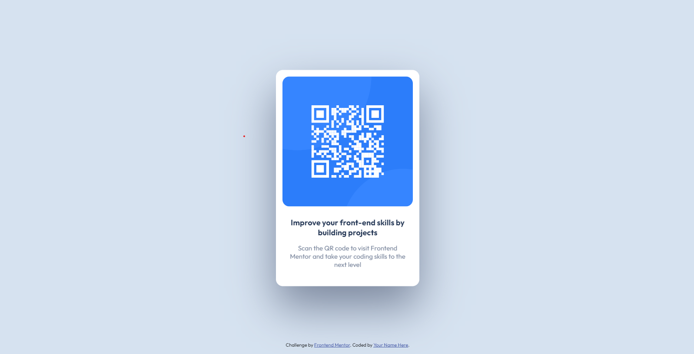

# Frontend Mentor - QR code component solution

This is a solution to the [QR code component challenge on Frontend Mentor](https://www.frontendmentor.io/challenges/qr-code-component-iux_sIO_H). Frontend Mentor challenges help you improve your coding skills by building realistic projects. 

## Table of contents

- [Overview](#overview)
  - [Screenshot](#screenshot)
  - [Links](#links)
- [My process](#my-process)
  - [Built with](#built-with)
  - [What I learned](#what-i-learned)
  - [Continued development](#continued-development)
  - [Useful resources](#useful-resources)
- [Author](#author)
- [Acknowledgments](#acknowledgments)

**Note: Delete this note and update the table of contents based on what sections you keep.**

## Overview

### Screenshot

### Links

- Solution URL: [View the site](https://insahub.github.io/qr-code-component-main/)

## My process

### Built with

- Semantic HTML5 markup
- CSS custom properties
- Mobile-first workflow

### What I learned

I learned basic html and css

### Continued development

I am going to read about css.

### Useful resources

- [W3Schools](https://www.w3schools.com/css/) - This helped to learn css.
- [Mozilla developer](https://developer.mozilla.org/en-US/docs/Web/CSS) - Also this website is the best to learn html, css and JS.

## Author

- Website - [Fasil Teshome](https://fasteshome.com)
- Frontend Mentor - [@INSAHub](https://www.frontendmentor.io/profile/INSAHub)

## Acknowledgments

 [Frontend Mentor](https://www.frontendmentor.io) Thank you for preparing this challange
